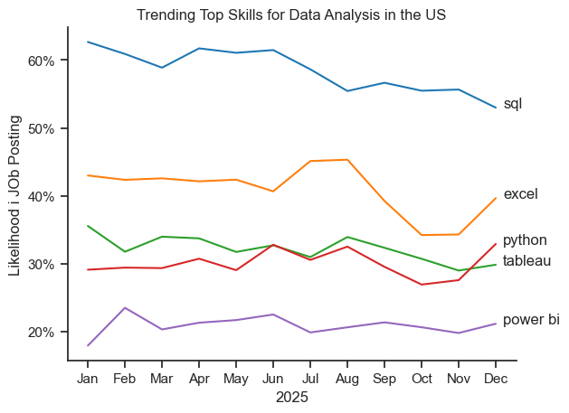
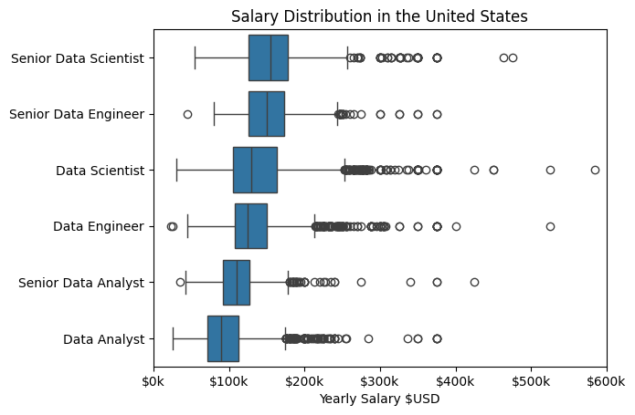
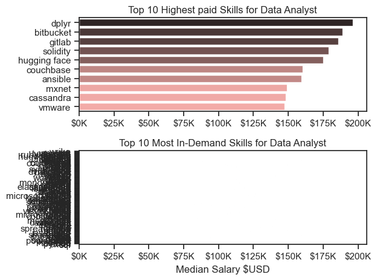
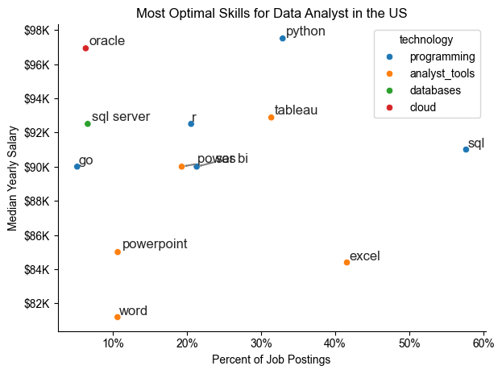

# The Analysis 

# 1. What are the skills most in demand for the top 3 most popular data roles?

To find the most demanded skills for the top 3 most popular data roles. I filtered out those positions by which ones were the most popular, and got the top 5 skills for these top 3 roles. This query highlights the most popular job titles and their top skills, showing which skills I should pay attention to depending on the role I'm targeting.

View my notebook with deatiles here: 
[2_skill_demand.ipynb](5_project\2_skill_demand.ipynb)

code: fig, ax = plt.subplots(len(job_titles), 1)

for i, job_title in enumerate(job_titles):
    df_plot = df_skills_perc[df_skills_perc['job_title_short'] == job_title].head(5)[::-1]
    sns.barplot(data=df_plot, x='skill_percent', y='job_skills', ax=ax[i], hue='skill_count', palette='dark:b_r')

plt.show()

# results

# insights

-Python , SQL, and Excel are needed for todays data market

🧠 Core Skills
- Python (and libraries like pandas, NumPy, scikit-learn, matplotlib, seaborn)
- SQL for querying relational databases
- Statistics & Probability for modeling, inference, and significance testing
- Data Cleaning & Wrangling (handling nulls, outliers, normalization, etc.)
- Exploratory Data Analysis (EDA) for discovering trends and anomalies
- Data Visualization (Plotly, Matplotlib, Seaborn, Tableau, Power BI)
- Machine Learning Basics (classification, regression, clustering)
- Communication & Storytelling using data to present actionable insights

# 2.How in - demand skills trending for Data analyst roles? 

# insights

- SQL

- Excel

- Python

# 3. Better to move on to a Scientist and an Eengineer

- From my Analysis instead of moving to a senior Data analyst role, it may be best to move onto a Engineering role and a Scientist. 

# 4. Pays to learn python

# 5. Optimal Skills for Data Analyst

